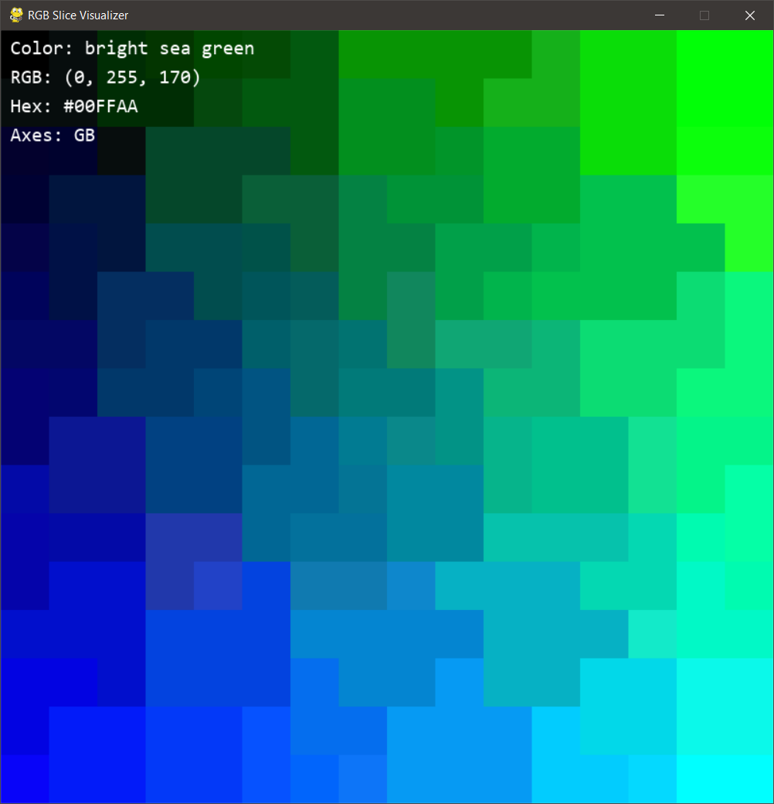
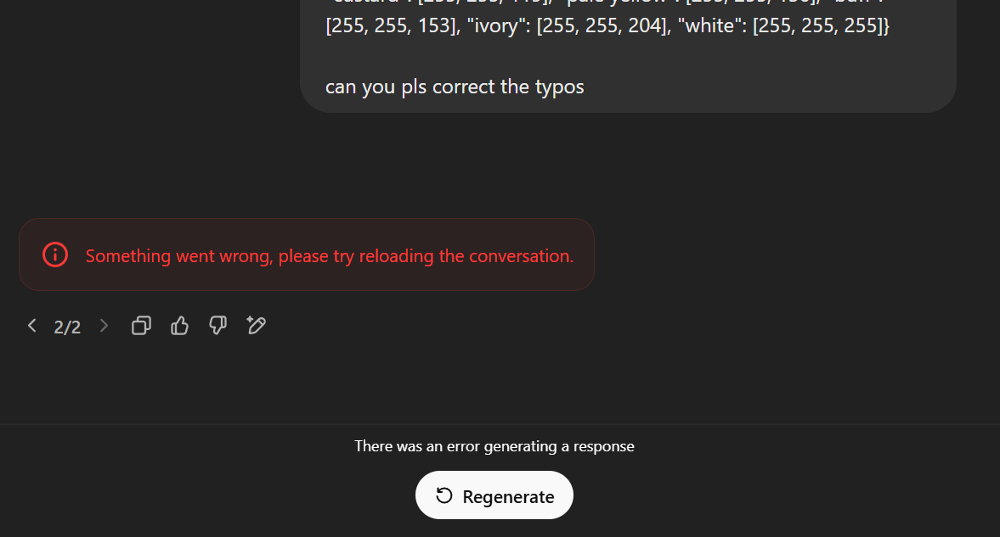
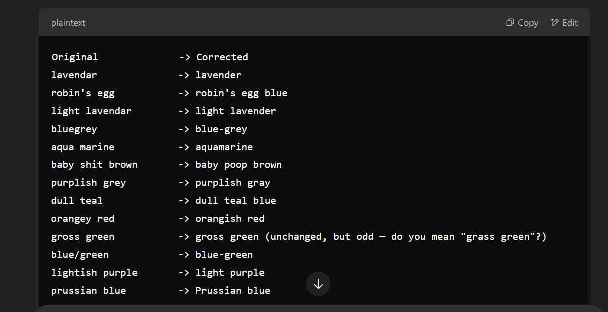
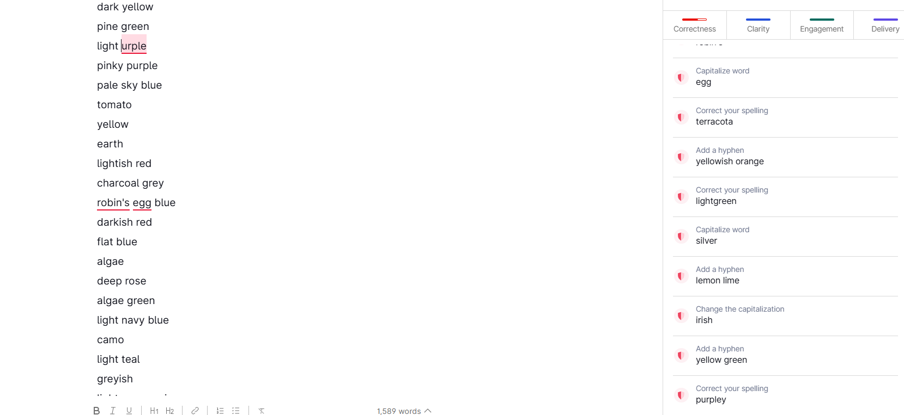

# 12-bit xkcd color names

See `colornames.json` for a mapping between the [color names from the xkcd color survey](https://xkcd.com/color/rgb.txt) and their closest 12-bit color.

## Background

I was writing a program that lets users select colors (for a color scheme) that restricted the color space to 12-bit (4096 total) colors. 

The typical color encoding is 24-bit, also known as "true color", which lets you specify colors like `#ffffff` (white) or `#DFFF00` (navy blue). This results in a total of $16^6 = 2^{24}$ or 16,777,216 different colors.

However, in 12-bit color, the hex codes are limited to only 3 hex digits - one for each pair in a typical hex code, bringing the total number of colors in the space down to $16^3$ or 4096. This limitation makes it easier for users to enter colors in my usecase, which has them select the R/G/B values on sliders with 16 different choices (`0`, `1`, `2`, ..., `E`, `F`).

One upside to this limitation is that it's easy to store names for each of these colors, which is a nice touch to give the user a description of the color they've chosen. I planned on using the names from the [xkcd rgb list](https://xkcd.com/color/rgb.txt), but there were fewer than 1000 of them and I needed over 4000. Also, I needed to map to colors of a very specific form, but the xkcd colors looked like this:

```plaintext
cloudy blue	#acc2d9	
dark pastel green	#56ae57	
dust	#b2996e	
```

To create a mapping, I had to map from each of the colors in 12-bit space to the closest match in the xkcd list, which wasn't hard:

```python
def sqdist(a, b):
    return (a - b)**2

def toRgb(color):
    color = color.strip('#')
    r = int(color[:2], 16)
    g = int(color[2:4], 16)
    b = int(color[4:], 16)
    return (r, g, b)

# distance between colors
def colorOffset(colorA, colorB):
    ra, ga, ba = toRgb(colorA)
    rb, gb, bb = toRgb(colorB)
    return (sqdist(ra, rb) + sqdist(ga, gb) + sqdist(ba, bb))**(1/3)
```

I was able to minimize the results of `colorOffset` across the entire space of xkcd colors for each of the 12-bit colors, giving me a name for each of the colors that most closely matched it.

## Visualization

To verify that the mapping was decent, I used ChatGPT to create a simple PyGame program that displayed "slices" of the color space with 2 length-16 axes at a time (swappable using the left/right arrow keys), at a slice of the third axis (adjustable using the up/down arrow keys, to go "forward" and "backward" through the color cube).

The result looks like this:



## Typos

One issue with the xkcd color names is that they contain some typos - for instance, "liliac" instead of lilac, or "lavendar" instead of lavender. These were easy enough to fix as well:

```python
def correct(l):
    replacements = {
        'lavendar':'lavender',
        'perrywinkle':'periwinkle',
        'forrest':'forest',
        'liliac':'lilac',
        ' urple':'purple',
    }
    for k,v in replacements.items():
        l = l.replace(k, v)
    return l
```

I tried to put the list of xkcd colors into ChatGPT to see if it could tell me what the incorrectly spelled ones were, but it wasn't up to the task:



I tried again in a new window with only the color names (not including the hex codes), but it still didn't do very well - it removed some of the character of the original names, and added some things that weren't needed:



Grammarly ended up being more useful: 



The color names also contain some dupes, e.g. "terra cotta" vs. "terracotta" and "bluegreen" vs. "bluegreen". I left these alone but will probably fix them before the project is done.

## Notes

In order to run the visualization with PyGame, you need to:

- have PyGame installed
- have the Consolas font installed (or change the font in `viz.py`)
- first run through the Python notebook (run all cells) to generate the mapping for use with `shelve`

After you have done the above, you should be able to run the visualization with `python viz.py`.
